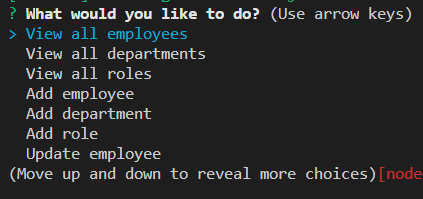
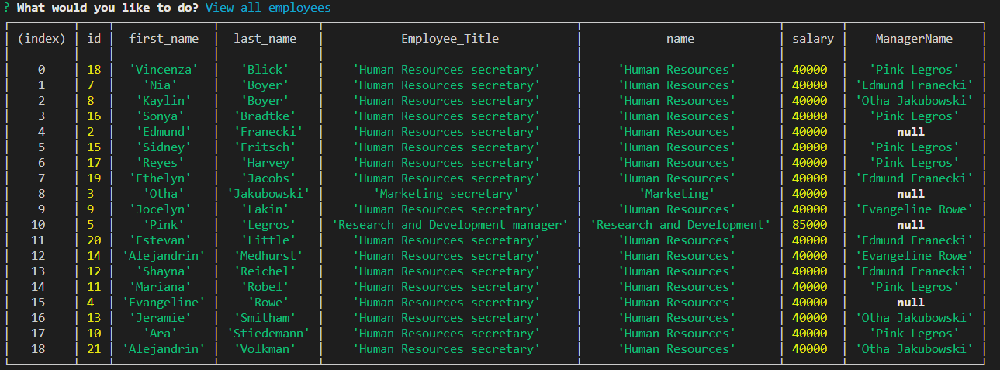
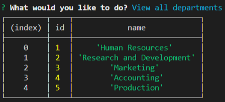
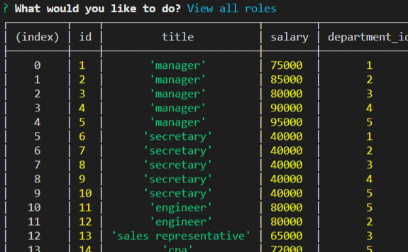

# MySQL Team Manager

## Description
This project was designed to get us acquainted with MySQL and SQL queries. We did this by using inquirer for the user to be able to interact with our database. This app should be fairly self explanatory to use based on its simple design. 

This was a great exercise to really understand what is happening with our queries and interactions with the database.And it was a good introduction to database management. 

There are a couple of functions that don't operate totally correctly, which would need to be debugged in the future. 

Here are a view of the screenshots from the app. 

